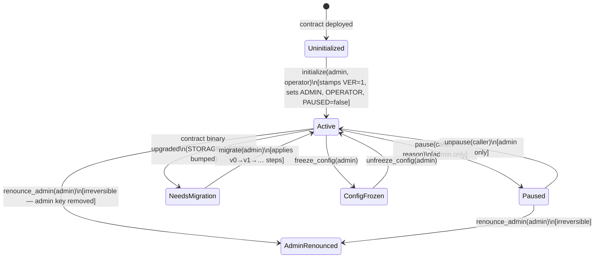
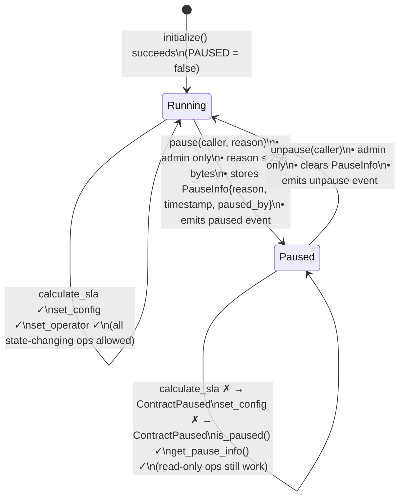
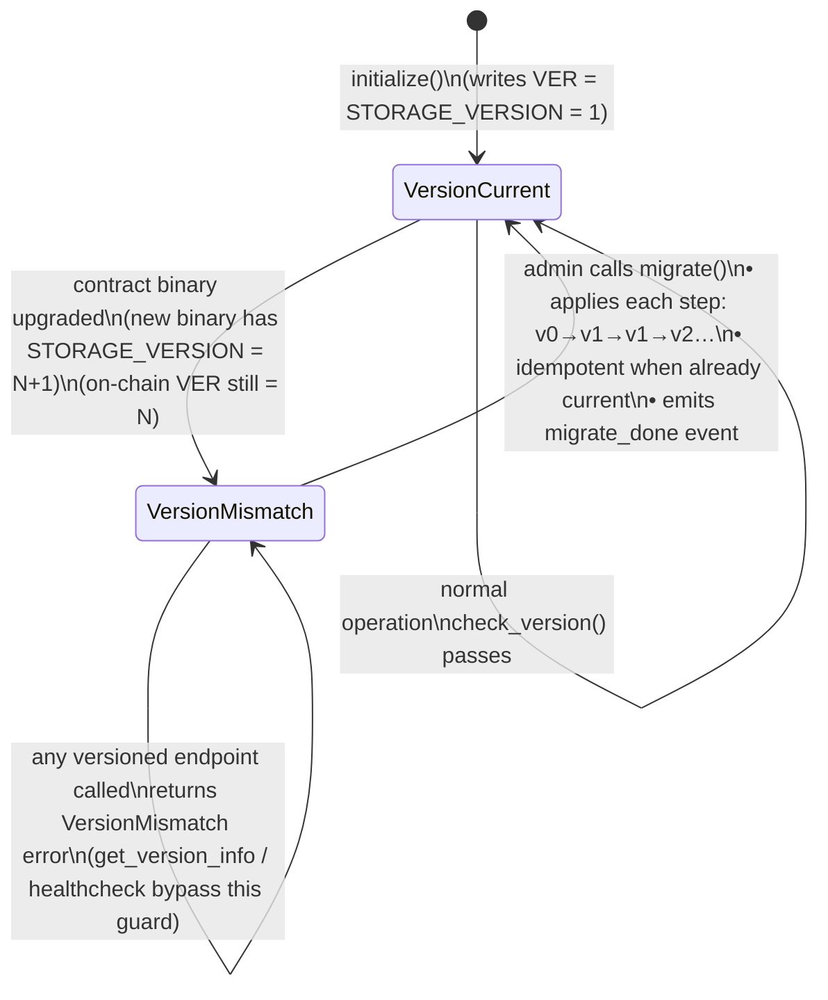
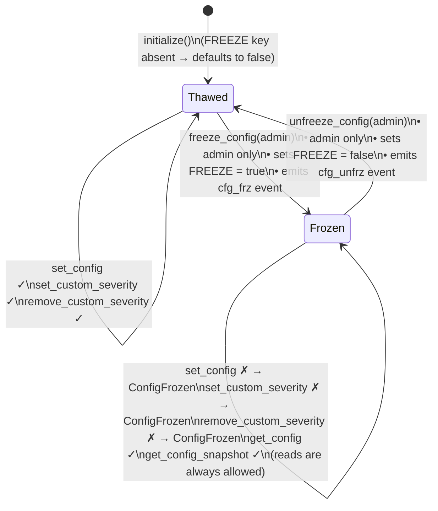
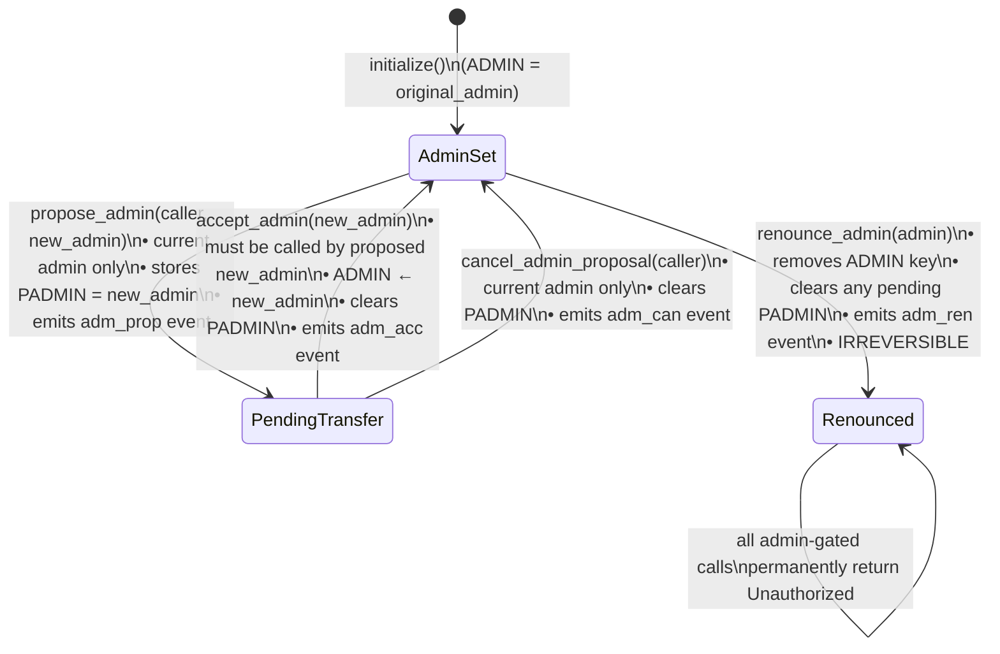
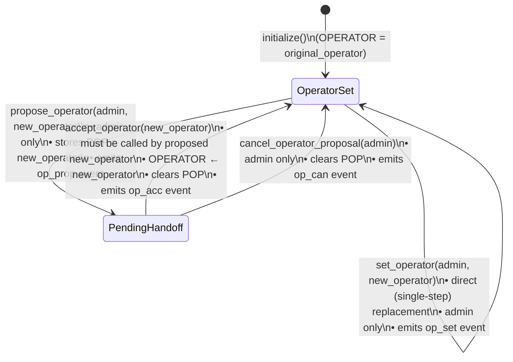

# Contract Lifecycle State Diagram

> State-transition reference for the `apexchainx_calculator` contract.  
> Resolves [#256](https://github.com/ApexChainx/ApexChainx-Contracts/issues/256).  
> All transitions are sourced directly from
> `apexchainx_calculator/src/lib.rs`, `governance.rs`, and `config_freeze.rs`.

---

## Table of Contents

1. [Overview](#overview)
2. [Top-level lifecycle](#top-level-lifecycle)
3. [Pause / Unpause flow](#pause--unpause-flow)
4. [Storage migration flow](#storage-migration-flow)
5. [Config-freeze flow](#config-freeze-flow)
6. [Admin transfer (two-step)](#admin-transfer-two-step)
7. [Operator handoff (two-step)](#operator-handoff-two-step)
8. [Combined orthogonal state matrix](#combined-orthogonal-state-matrix)
9. [Invariants and guard table](#invariants-and-guard-table)

---

## Overview

The contract has **four independent boolean axes** that combine to determine
which operations are permitted at any moment:

| Axis | Storage key | Default | Blocks |
|------|-------------|---------|--------|
| Initialized | `ADMIN` present | false | All versioned calls |
| Paused | `PAUSED` | false | `calculate_sla`, state-changing ops |
| Version-matched | `VER == STORAGE_VERSION` | true after init | All versioned calls |
| Config frozen | `FREEZE` | false | `set_config`, `set_custom_severity`, `remove_custom_severity` |

The diagrams below model each axis independently, then the matrix section
shows their interactions.

---

## Top-level lifecycle



> **Note:** `AdminRenounced` is a terminal state for governance.
> `pause`, `set_config`, and admin-transfer functions are permanently locked once
> `renounce_admin` is called because all require the `ADMIN` key to be present.

---

## Pause / Unpause flow



---

## Storage migration flow



**Key bypass functions** (callable even in `VersionMismatch` state):

| Function | Why it bypasses |
|----------|----------------|
| `get_version_info()` | Backend needs to read version before deciding to call `migrate` |
| `get_migration_state()` | Read-only diagnostic |
| `healthcheck()` | Load-balancer probe — must always respond |
| `migrate()` | The function that fixes the mismatch |

---

## Config-freeze flow



---

## Admin transfer (two-step)



---

## Operator handoff (two-step)



> **Note:** `set_operator` is a direct single-step replacement (legacy path).
> The two-step `propose_operator` / `accept_operator` flow is preferred for
> operational safety because it requires the incoming operator to confirm.

---

## Combined orthogonal state matrix

The four axes (initialized, version-matched, paused, config-frozen) are
independent but **stack**: a call fails at the first guard it hits.

Guard evaluation order inside `calculate_sla` and `set_config`:

1. `check_version()` → fails with `VersionMismatch` or `NotInitialized`
2. `require_not_paused()` (calculate_sla) → fails with `ContractPaused`
3. `require_admin()` / `require_operator()` → fails with `Unauthorized`
4. `require_not_frozen()` (set_config) → fails with `ConfigFrozen`

```
                        │ Not Init │ NeedsMigr. │ Running │ Paused │
────────────────────────┼──────────┼────────────┼─────────┼────────┤
 initialize()           │    ✓     │     ✓      │    ✗    │   ✗    │
 migrate()              │    ✗     │     ✓      │   nop   │   ✓    │
 calculate_sla()        │    ✗     │     ✗      │    ✓    │   ✗    │
 set_config()           │    ✗     │     ✗      │  ✓/✗*   │   ✗    │
 pause() / unpause()    │    ✗     │     ✗      │    ✓    │  ✓/✓   │
 freeze/unfreeze()      │    ✗     │     ✗      │  ✓/✓*   │   ✓    │
 get_version_info()     │    ✗     │     ✓      │    ✓    │   ✓    │
 healthcheck()          │    ✓     │     ✓      │    ✓    │   ✓    │
 get_result_schema()    │    ✗     │     ✗      │    ✓    │   ✓    │

* depends on ConfigFrozen axis (✗ when frozen, ✓ when thawed)
```

---

## Invariants and guard table

| Invariant | Where enforced |
|-----------|---------------|
| `initialize()` is called exactly once | `ADMIN_KEY` presence check at start of `initialize()` |
| All versioned endpoints require `VER == STORAGE_VERSION` | `check_version()` called at the top of every public function (except bypass list) |
| `calculate_sla` is blocked while paused | `require_not_paused()` called before operator check |
| `set_config` is blocked while config is frozen | `require_not_frozen()` called after admin check |
| Admin transfer requires proposee to accept | `PENDING_ADMIN_KEY` must be present and caller must match |
| Operator handoff requires proposee to accept | `PENDING_OP_KEY` must be present and caller must match |
| `renounce_admin` is irreversible | `ADMIN_KEY` is removed; no path to re-set it without `initialize()` |
| Custom severities cannot shadow canonical ones | `is_canonical_severity()` check in `set_custom_severity()` |
| History capped at `MAX_HISTORY_SIZE` (1000) or configurable limit | FIFO trim after every `calculate_sla` write |
| One outage capped at `MAX_RECALCS_PER_OUTAGE` (16) retained entries | Scan + count inside `calculate_sla` |

---

## Source references

| Transition / guard | Implementation location |
|--------------------|------------------------|
| `initialize()` | `lib.rs::SLACalculatorContract::initialize` |
| `pause()` / `unpause()` | `lib.rs::SLACalculatorContract::pause` / `unpause` |
| `freeze_config()` / `unfreeze_config()` | `config_freeze.rs::freeze_config` / `unfreeze_config` |
| `migrate()` | `lib.rs::SLACalculatorContract::migrate` |
| `check_version()` | `lib.rs::SLACalculatorContract::check_version` |
| `propose_admin()` / `accept_admin()` | `governance.rs::propose_admin` / `accept_admin` |
| `renounce_admin()` | `governance.rs::renounce_admin` |
| `propose_operator()` / `accept_operator()` | `governance.rs::propose_operator` / `accept_operator` |
| `set_operator()` | `governance.rs::set_operator` |
