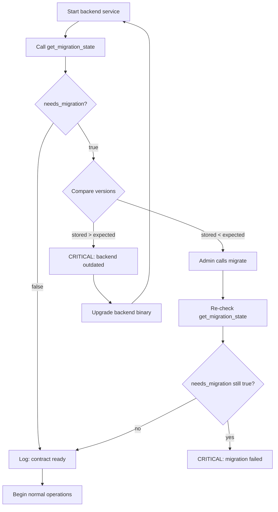

# Migration State Consumption Guide

> **Audience:** Backend integration engineers, operator tooling developers,
> and SRE teams responsible for deploying and monitoring `apexchainx_calculator`
> contract upgrades.
>
> **Purpose:** Document how `get_migration_state()` should be consumed by
> backend services and operator tooling to ensure safe contract upgrades,
> rollback safety, and continuous monitoring.

---

## Table of Contents

- [Overview](#overview)
- [API Reference](#api-reference)
- [Backend Startup Handshake](#backend-startup-handshake)
- [Operator Tooling Integration](#operator-tooling-integration)
- [Monitoring & Alerting](#monitoring--alerting)
- [Deployment Pipeline Integration](#deployment-pipeline-integration)
- [Troubleshooting](#troubleshooting)
- [Operator Runbook](#operator-runbook)

---

## Overview

`get_migration_state()` is a **read-only**, **unauthenticated** function that
returns the current storage version and migration posture of the
`apexchainx_calculator` contract. It is designed to be the **first call** any
backend or operator tool makes after connecting to the contract.

The function intentionally **bypasses** `check_version()` so it remains
callable even when the contract is in a pre-migration or pre-initialization
state — backends **must** be able to read the migration state before
deciding whether to call `migrate()`.

---

## API Reference

### Function Signature

```rust
pub fn get_migration_state(env: Env) -> Result<StorageVersionInfo, SLAError>
```

### Return Type: `StorageVersionInfo`

| Field | Type | Description |
|-------|------|-------------|
| `stored_version` | `u32` | The storage schema version currently stamped on-chain |
| `expected_version` | `u32` | The storage schema version this contract binary expects |
| `needs_migration` | `bool` | `true` when `stored_version != expected_version` |

### Error Codes

| Error | Condition | Action |
|-------|-----------|--------|
| `NotInitialized` (code 2) | Contract has never been initialized — `STORAGE_VERSION_KEY` is absent | The contract must be initialized before any operations. Call `initialize(admin, operator)`. |

---

## Backend Startup Handshake

### Recommended Startup Sequence



### Pseudocode

```python
# Python pseudocode — adapt to your language/runtime
def startup_handshake(contract_client, admin_wallet):
    state = contract_client.get_migration_state()

    if not state.needs_migration:
        logger.info(f"Contract ready. Storage version: {state.stored_version}")
        return True

    if state.stored_version < state.expected_version:
        logger.warning(
            f"Contract behind (stored={state.stored_version}, "
            f"expected={state.expected_version}). Running migration..."
        )
        admin_wallet.invoke(contract_client.migrate)

        # Re-check after migration
        state = contract_client.get_migration_state()
        if state.needs_migration:
            logger.error("Migration did not resolve version mismatch!")
            return False
        logger.info(f"Migration successful. Version now {state.stored_version}")
        return True

    else:  # stored_version > expected_version
        logger.error(
            f"Backend outdated! Contract is at version {state.stored_version}, "
            f"but this binary only supports {state.expected_version}. "
            "Upgrade backend before proceeding."
        )
        return False
```

### Important Rules

| Rule | Rationale |
|------|-----------|
| **Always call first** | Every backend instance must call `get_migration_state()` before issuing any operational transactions |
| **Never skip the check** | Skipping the migration check risks `VersionMismatch` errors on every subsequent call |
| **No auth required** | The function is public — any caller can read the migration state |
| **Idempotent** | Multiple calls return the same result until state changes |
| **Deterministic** | For a given storage state, the result is always identical |

---

## Operator Tooling Integration

### CLI Tool: Pre-Flight Check

A simple operator CLI can wrap `get_migration_state()` to verify contract
readiness before deployment:

```bash
#!/usr/bin/env bash
# preflight-check.sh — verify contract readiness
set -euo pipefail

echo "Checking migration state..."
# Uses soroban-cli to invoke the contract
STATE=$(soroban contract invoke \
    --id "$CONTRACT_ID" \
    --rpc-url "$RPC_URL" \
    --fn get_migration_state)

STORED=$(echo "$STATE" | jq -r '.stored_version')
EXPECTED=$(echo "$STATE" | jq -r '.expected_version')
NEEDS_MIGRATION=$(echo "$STATE" | jq -r '.needs_migration')

echo "Stored version: $STORED"
echo "Expected version: $EXPECTED"
echo "Needs migration: $NEEDS_MIGRATION"

if [[ "$NEEDS_MIGRATION" == "true" ]]; then
    echo "WARNING: Migration required!"
    if [[ "$STORED" -lt "$EXPECTED" ]]; then
        echo "Contract is behind. Run: migrate.sh"
    else
        echo "ERROR: Backend is outdated. Upgrade required."
        exit 1
    fi
else
    echo "OK: Contract is ready."
fi
```

### Terraform / Pulumi Integration

In infrastructure-as-code pipelines, add a data source that reads
`get_migration_state()` and blocks the apply step if migration is needed:

```hcl
# Terraform example
data "external" "migration_state" {
  program = ["soroban", "contract", "invoke",
    "--id", var.contract_id,
    "--fn", "get_migration_state"
  ]
}

resource "null_resource" "migration_gate" {
  lifecycle {
    precondition {
      condition     = !data.external.migration_state.result.needs_migration
      error_message = "Contract migration required before deployment."
    }
  }
}
```

---

## Monitoring & Alerting

### Prometheus / Grafana Integration

Export `get_migration_state()` results as Prometheus metrics:

```python
# Prometheus exporter example
MIGRATION_STATE = Gauge(
    'apexchainx_contract_migration_needed',
    'Whether the contract needs migration',
    ['contract_id']
)
STORAGE_VERSION = Gauge(
    'apexchainx_contract_storage_version',
    'Current storage version on-chain',
    ['contract_id']
)
EXPECTED_VERSION = Gauge(
    'apexchainx_contract_expected_version',
    'Expected storage version from binary',
    ['contract_id']
)

def collect_metrics():
    state = contract.get_migration_state()
    MIGRATION_STATE.labels(contract_id=CONTRACT_ID).set(
        1 if state.needs_migration else 0
    )
    STORAGE_VERSION.labels(contract_id=CONTRACT_ID).set(state.stored_version)
    EXPECTED_VERSION.labels(contract_id=CONTRACT_ID).set(state.expected_version)
```

### Alert Rules

| Alert Name | Condition | Severity | Response |
|------------|-----------|----------|----------|
| `ContractNeedsMigration` | `needs_migration == true` AND `stored < expected` | Warning | Admin must call `migrate()` |
| `ContractAheadOfBackend` | `needs_migration == true` AND `stored > expected` | Critical | Backend binary must be upgraded |
| `ContractNotInitialized` | `get_migration_state()` returns `NotInitialized` | Critical | Contract must be initialized |
| `MigrationStateFlapping` | `needs_migration` changes more than once in 10 minutes | Critical | Possible state corruption or unauthorised upgrade |

---

## Deployment Pipeline Integration

### CI/CD Gate Steps

1. **Pre-deploy check** — Before deploying a new backend version, read
   `get_migration_state()` from the target contract
2. **Version comparison** — Compare `stored_version` against the new binary's
   `expected_version`
3. **Block or warn** — If migration would be needed, block the deployment or
   require manual approval
4. **Post-deploy verification** — After deployment, verify `needs_migration`
   is `false` and log the `stored_version`

### Example: GitHub Actions Step

```yaml
- name: Verify contract migration state
  run: |
    STATE=$(soroban contract invoke \
      --id ${{ vars.CONTRACT_ID }} \
      --rpc-url ${{ vars.SOROBAN_RPC_URL }} \
      --fn get_migration_state)
    NEEDS_MIGRATION=$(echo "$STATE" | jq -r '.needs_migration')
    if [[ "$NEEDS_MIGRATION" == "true" ]]; then
      echo "ERROR: Contract needs migration before deployment."
      exit 1
    fi
    echo "Contract is ready."
```

---

## Troubleshooting

### Symptom: `get_migration_state()` returns `NotInitialized`

**Cause:** The contract has never been initialized — `STORAGE_VERSION_KEY` does
not exist in storage.

**Fix:** Call `initialize(admin, operator)` on the contract.

### Symptom: `needs_migration` is `true` even after calling `migrate()`

**Causes:**
1. Caller is not the admin — `migrate()` requires `require_auth()` from the
   admin address
2. `migrate()` encountered an unknown stored version and returned
   `VersionMismatch` without mutating state
3. The contract binary was upgraded again between the `migrate()` call and
   the re-check

**Fix:** Verify the caller is the admin address stored in `ADMIN_KEY`.
Check the return value of `migrate()` — it will return an error if migration
failed.

### Symptom: `needs_migration` flips to `true` unexpectedly during operations

**Cause:** The contract binary was upgraded by an admin while the backend was
running.

**Fix:** The backend should call `get_migration_state()` periodically as a
health check. If `needs_migration` flips to `true`:
1. Pause operational transactions
2. Re-run the startup handshake flow
3. If `stored < expected`, admin must call `migrate()`
4. If `stored > expected`, the backend binary must be upgraded

---

## Operator Runbook

### Runbook: Contract Upgrade

```
SUMMARY: Upgrade contract binary to new storage version
DURATION: ~5 minutes
IMPACT: Backend must pause operational transactions during migration

STEPS:
1. Deploy new contract binary (soroban contract deploy --wasm ...)
2. Call get_migration_state() to confirm stored_version < expected_version
3. Have admin call migrate()
4. Call get_migration_state() again to confirm needs_migration == false
5. Resume normal operations
6. Verify events: check migrate_done event was emitted
```

### Runbook: Unexpected Migration State

```
SUMMARY: Backend detects needs_migration unexpectedly
DURATION: ~15 minutes
IMPACT: Operational transactions will fail until resolved

STEPS:
1. Read get_migration_state() to determine direction:
   a. stored < expected → contract was upgraded → run migrate()
   b. stored > expected → backend is outdated → upgrade backend
2. If neither direction makes sense → investigate state corruption
3. After resolution, verify get_migration_state() returns needs_migration=false
4. Resume normal operations
```

---

## Related Documents

- [Compatibility Tracking Matrix](COMPATIBILITY_TRACKING_MATRIX.md) — Storage-version migration matrix
- [Contract Maintenance Policy](CONTRACT_MAINTENANCE_POLICY.md) — SC-500–SC-508 policies
- [Version Negotiation Protocol](../CONTRIBUTING.md#sc-502-version-negotiation-protocol--contributor-note) — Safe vs breaking changes
- [Storage-Key Namespace Checklist](../CONTRIBUTING.md#sc-100-storage-key--event-topic-namespace-collision-pre-merge-checklist) — Pre-merge collision checks
